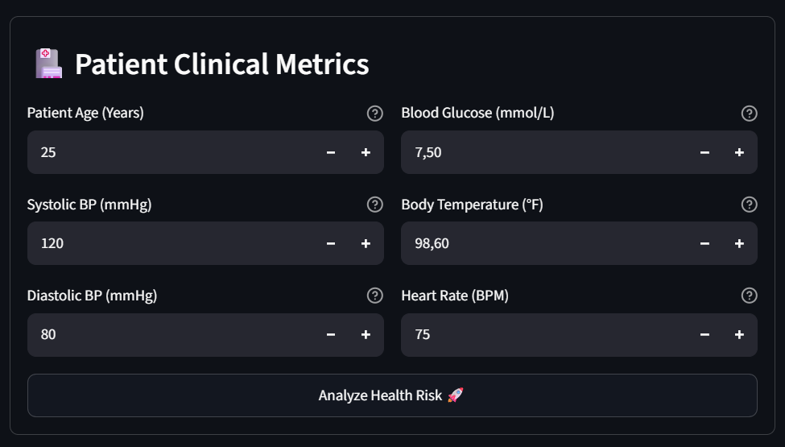
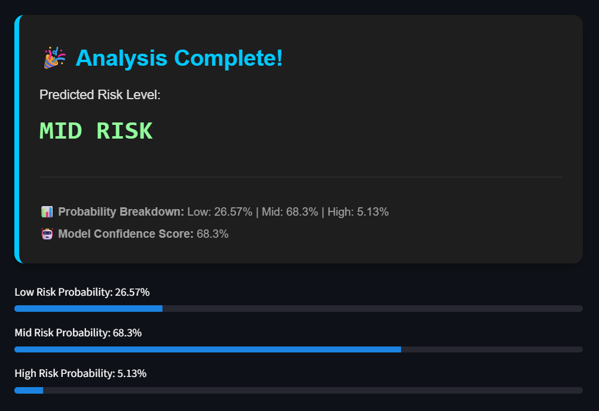
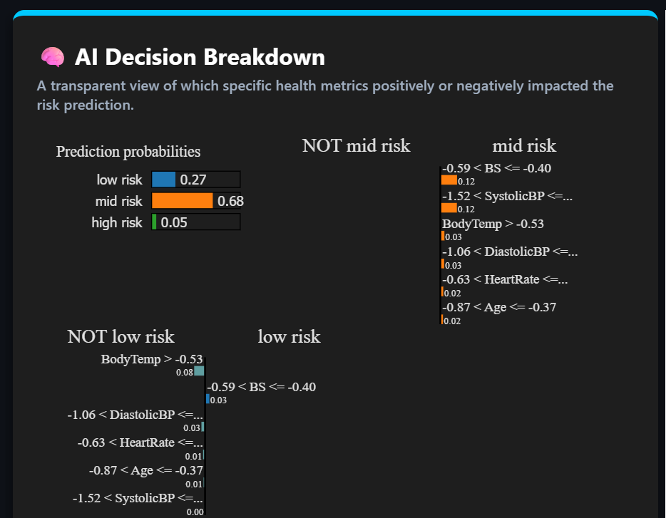
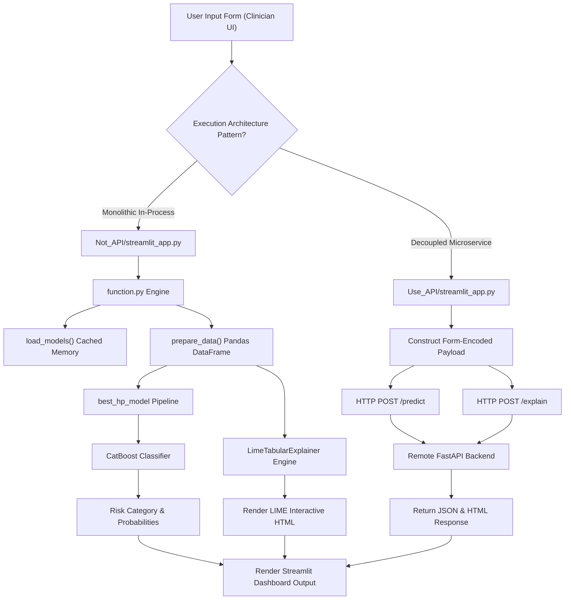

# 🚀 Dual-Pattern AI System for Maternal Health Risk Prediction & Explainability


## 📌 Overview

This project provides an interactive clinical risk-triage application for maternal health while serving as an enterprise-grade reference implementation comparing **two distinct software architecture patterns** for machine learning deployments:

1. **Monolithic In-Process Pattern (`Not_API/streamlit_app.py` + `Not_API/function.py`):** The Streamlit frontend directly loads model artifacts and executes preprocessing, model inference, and Local Interpretable Model-agnostic Explanations (LIME) within a single Python runtime process.
2. **Decoupled Microservice / Client-Server Pattern (`Use_API/streamlit_app.py`):** The Streamlit frontend acts purely as a light presentation layer, offloading inference payloads via HTTP REST endpoints (`POST /predict` and `POST /explain`) to a remote FastAPI microservice backend.

The system ingests vital maternal physiological measurements—Age, Systolic/Diastolic Blood Pressure, Blood Glucose, Body Temperature, and Heart Rate—to categorize physiological risk into three clinical tiers: **Low Risk**, **Mid Risk**, and **High Risk**. To bridge the trust gap in clinical decision-making, every prediction is backed by transparent, feature-level Explainable AI (XAI) attribution plots.

---

## 🎯 Context & Problem Statement

### 🏥 The Clinical Problem
Maternal mortality and severe pregnancy complications represent critical global health challenges. In resource-constrained clinical settings or rural healthcare centers, subtle physiological risk factors often go undetected until acute complications occur. Early, data-driven risk triage enables healthcare providers to prioritize high-risk patients for immediate specialist intervention.

### 💡 The Solution & Engineering Challenge
Machine learning models often operate as "black boxes," hindering adoption by medical professionals who require interpretable reasoning before making diagnostic decisions. Furthermore, ML engineers face operational trade-offs between monolithic, tightly coupled Streamlit deployments (fast to prototype, high memory footprint) and decoupled microservice architectures (scalable, isolated compute, but higher network latency).

This system solves both problems by:
* 🩺 Providing **clinically actionable risk predictions** paired with instant **local feature attribution (LIME XAI)**.
* 🏗️ Serving as a **side-by-side architectural blueprint** comparing monolith vs. microservice deployment strategies.

---

## 📊 Quantitative Metrics

The underlying intelligence across both deployment patterns relies on a hyperparameter-tuned 3-class **CatBoost Classifier** pipeline trained on multi-center clinical patient metrics.

### 📈 Evaluation Summary

* **Dataset Source:** UCI Maternal Health Risk Dataset (rural healthcare facility collection)
* **Total Cleaned Samples:** 452 unique patient instances
* **Train / Test Distribution:** 361 training instances (80%) / 91 held-out test instances (20%)

| Performance Metric | Evaluation Score |
| :--- | :--- |
| **Accuracy** | **71.00%** |
| **Macro Precision** | **64.95%** |
| **Macro Recall** | **63.07%** |
| **Macro F1-Score** | **63.13%** |
| **Log Loss** | **0.6590** |

---

## 📷 Screenshots & Demo

### 1. Interactive Assessment Interface
  
*Clinical parameter entry form enforcing physiological range boundaries and real-time form validation.*

### 2. Risk Prediction & Distribution Triage
  
*Categorical risk triage output displaying confidence percentages and probability distributions across all risk classes.*

### 3. Local Explainability (LIME XAI Plot)
  
*Feature contribution plot highlighting individual biological drivers for the specific patient assessment.*

---

## ⚙️ Architecture & Data Flow

### 🏗️ Engineering Deep Dive
The system offers two execution pathways designed to highlight the trade-offs between local compute and distributed service calls:

* **Monolithic Pathway (`Not_API/streamlit_app.py`):** Utilizes `function.py` with Streamlit's `@st.cache_resource` decorator to load heavy binary artifacts (`best_hp_model.joblib`, `lime_training_data.npy`, `feature_names.joblib`) into shared RAM on application boot. Prediction and local surrogate training (LIME) execute in-memory, avoiding network overhead.
* **Microservice Pathway (`Use_API/streamlit_app.py`):** Form inputs are serialized into a form-encoded payload and dispatched over HTTP POST requests to an external FastAPI backend. The UI delegates computation and renders returned JSON/HTML responses.

### 🔄 End-to-End System Flowchart


*Note: This architecture diagram is AI-generated using Mermaid.js. If you encounter rendering issues on certain platforms, minor manual syntax adjustments (e.g., escaping special characters or fixing subgraph IDs) may be required.*

---

## 💻 Installation & Reproduction Steps

### 📋 Prerequisites
* **Python**: `3.8+` (Tested on Python 3.10)
* **Package Manager**: `pip` or `conda`

### 🛠️ CLI Installation & Execution

#### 1. Clone the Repository
```bash
git clone https://github.com/viochris/Maternal-Health-Risk-Streamlit.git
cd Maternal-Health-Risk-Streamlit
```

#### 2. Create and Activate Virtual Environment
```bash
# macOS/Linux
python3 -m venv venv
source venv/bin/activate

# Windows
python -m venv venv
venv\Scripts\activate
```

#### 3. Install Dependencies
```bash
pip install --upgrade pip
pip install -r requirements.txt
```

#### 4. Launch Applications

##### 🏃 Option A: Run Monolithic Application (In-Process Execution - Recommended)
```bash
cd Not_API
streamlit run streamlit_app.py
```

##### 🏃 Option B: Run Microservice Client Application
```bash
cd Use_API
streamlit run streamlit_app.py
```

---

## ⚠️ System Limitations & Future Work

### 🚨 Live Streamlit Deployment Status
* **Monolithic Direct Application:** **FULLY FUNCTIONAL** — live at [maternal-health-risk-app-no-api.streamlit.app](https://maternal-health-risk-app-no-api.streamlit.app/). Executes predictions and LIME explanations in-process using local artifacts via `function.py`.
* **API-Consumer Client Application:** **DEMONSTRATION ONLY** — live at [maternal-health-risk-app-use-api.streamlit.app](https://maternal-health-risk-app-use-api.streamlit.app/). The hardcoded remote base URL points to an inactive backend server. As a result, form submissions on this variant fail with a `[NETWORK ERROR]` by design to showcase client-side error handling resilience.

### 🏗️ Architectural Limitations
* **Codebase Duplication:** UI formatting, CSS stylesheets, form range validations, and LIME dark-mode overrides are maintained independently in both Streamlit application files.
* **Single-Instance Processing (N=1):** The system processes single-patient form inputs; batch processing via CSV upload is currently unsupported.
* **Sequential Execution Overhead:** Explanations require invoking a separate `explain()` step post-prediction. In the microservice model, this triggers two sequential HTTP calls (`/predict` and `/explain`), adding network latency.

### 🔬 Runtime & Domain Limitations
* **Class Imbalance Sensitivity ("Mid Risk"):** The model yields lower F1-scores (~0.29) on the "Mid Risk" class due to boundary overlap between Low and High risk categories in the dataset.
* **Demographic Generalizability:** Model weights are derived from 452 patient instances collected in rural Bangladesh; performance may vary when evaluated on broader population cohorts.
* **Security Constraints:** Designed as a technical demonstration, the system lacks embedded rate-limiting, user authentication, and enterprise access logging.

---

---
**Author:** [Silvio Christian, Joe](https://github.com/viochris)

*"Bridging modern software design patterns with interpretable clinical machine learning."*
